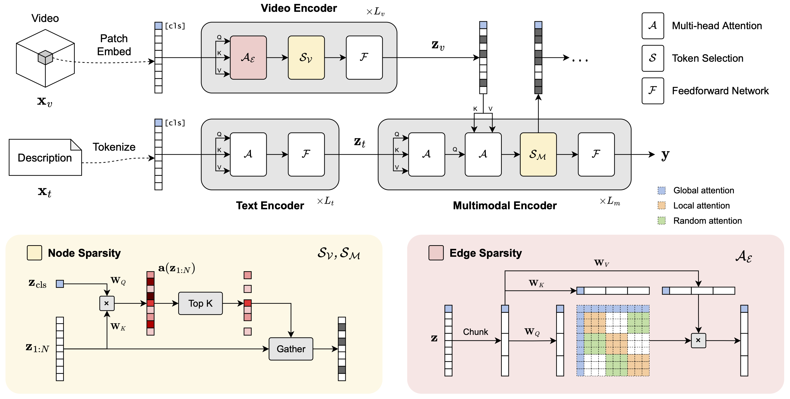

# SViTT: Temporal Learning of Sparse Video-Text Transformers (CVPR 2023)

[Yi Li](http://www.svcl.ucsd.edu/people/yili)<sup>1</sup>, [Kyle Min](https://sites.google.com/view/kylemin)<sup>2</sup>, [Subarna Tripathi](https://subarnatripathi.github.io/)<sup>2</sup>, [Nuno Vasconcelos](http://www.svcl.ucsd.edu/~nuno)<sup>1</sup>

<sup>1</sup>University of California, San Diego, <sup>2</sup>Intel Labs

**[Project page](http://svcl.ucsd.edu/projects/svitt/) | [Paper](https://arxiv.org/abs/2304.08809) | [8-min video](https://www.youtube.com/watch?v=11MZj4xkZyY)**

This repository contains PyTorch implementation of **`SViTT`**, a sparse multimodal transformer for video-language learning.

<p align="center">
  
</p>

## Get started

```bash
conda env create -n svitt --file environment.yml
conda activate svitt
```

### Data

All datasets are expected under `data/` directory with the following structure (other downstream datasets follow the same structure as MSRVTT):
```
data/
├── anno_pretrain/
│   └── webvid_train.json
├── anno_downstream/
│   ├── msrvtt_test1k.json
│   └── ...
├── webvid_videos/
│   └── *.mp4
├── msrvtt_videos/
│   └── *.mp4
└── ...
```

Raw videos should be downloaded from the websites of respective datasets. Annotations for pre-training and downstream tasks are available in the [Singularity](https://github.com/jayleicn/singularity/tree/main#annotations) repo; additional annotations for Charades and AGQA used in this work are available [here](https://nextcloud.nrp-nautilus.io/s/DBkBXnQsZaeoSzQ).

## Example usage

We follow the same structure of training and evaluation scripts as [Singularity](https://github.com/jayleicn/singularity), with additional options for temporal modeling and sparse training.

### Pre-training

To train a 4-frame SViTT model on WebVid: (use `arg=value` to override any arguments in [`configs/pretrain_webvid.yaml`](configs/pretrain_webvid.yaml))

```bash
bash scripts/pretrain.sh pt_webvid webvid $GPUS local \
    video_input.num_frames=4 \
    output_dir=$OUTPUT_DIR
```

To perform temporal sparse expansion to 8 frames:

```bash
bash scripts/pretrain.sh pt_webvid webvid $GPUS local \
    pretrained_path=$CKPT \
    video_input.num_frames=8 \
    vision_encoder_args.token_keep_rate=0.6 \
    output_dir=$OUTPUT_DIR
```

### Downstream evaluation

It is recommended to use the same sparsity parameters (`vision_encoder_args` and `joint_encoder_args`) as the pre-trained model, though you can also override them with different values.

To evaluate zero-shot text-to-video retrieval (MSRVTT, DiDeMo):
```bash
bash scripts/eval_ret.sh $DATASET $CKPT eval-ret-$DATASET local $GPUS
```

To fine-tune text-to-video retrieval (Charades, SSv2):
```bash
bash scripts/train_ret.sh $DATASET $CKPT train-ret-$DATASET local $GPUS
```

To fine-tune video question answering (MSRVTT-QA, ActivityNet-QA, AGQA):
```bash
bash scripts/train_qa.sh $DATASET $CKPT train-qa-$DATASET local $GPUS
```

## Acknowledgements
This project is built primarily on top of the awesome [Singularity](https://github.com/jayleicn/singularity) codebase.
We also acknowledge the use of several other open-source repositories, including [Frozen in Time](https://github.com/m-bain/frozen-in-time), [ALBEF](https://github.com/salesforce/ALBEF), and [🤗 Transformers](https://github.com/huggingface/transformers).
This work was funded in part by NSF award IIS-2041009.

## Citation

If you find this repo useful, please cite our work. Thanks!
```
@inproceedings{li2023svitt,
  title={{SViTT}: Temporal Learning of Sparse Video-Text Transformers},
  author={Li, Yi and Min, Kyle and Tripathi, Subarna and Vasconcelos, Nuno},
  booktitle={Proceedings of the IEEE/CVF Conference on Computer Vision and Pattern Recognition},
  pages={18919--18929},
  year={2023}
}
```